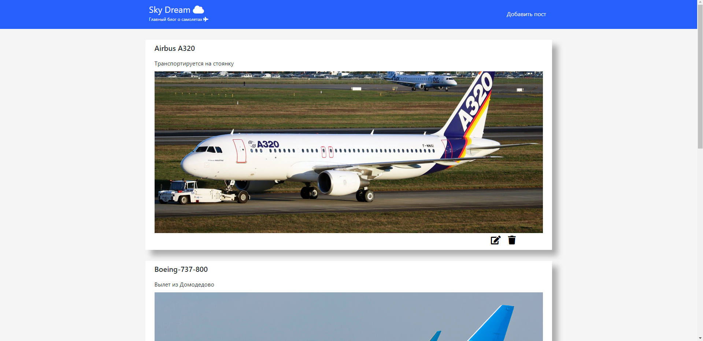

# SkyDream - учебный проект в котором реализованы основные CRUD-операции при помощи Angular и Spring  
Тематика - авиация :airplane:  
Главная страница:
  

Реализован следующий функционал:  
* Добавление поста   
* Изменение поста    
* Удаление поста    

## Необходимый инструментарий  
Для запуска вам потребуется:  
* Java 11
* Maven  
* Node Js
* npm 
* Angular Cli 
* MySql или MariaDB

### Загрузка проекта: 
* Клонируйте или скачайте проект 
`https://github.com/ScionRs/angular-skydream-app-crud-with-spring.git`
### Импорт базы данных:  
* Импортируйте базу данных **skydream** в свою среду
### Frontend  
*  Установите Angular Cli:  
`npm install -g @angular/cli`  
* Запустите проект с помощью команды `ng serve` или `ng serve --open`
### Backend  
* Запустите проект c помощью  `mvn spring-boot:run` или посредством нажатия клавиш Shift + F10
